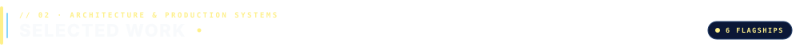
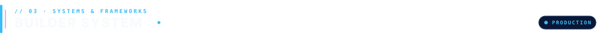
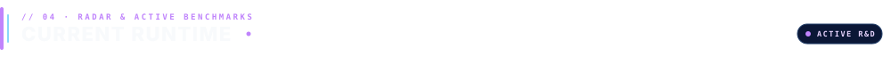
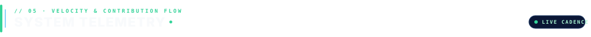
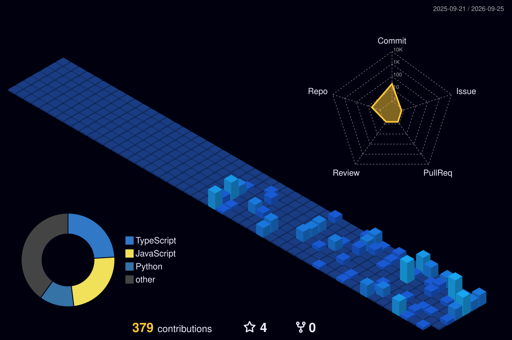

  

&nbsp;

&nbsp;

&nbsp;

&nbsp;

 

  

> **Applied AI Systems Engineer & Co-Founder @ [Interviewlary](https://interviewlary.com)** · *Computer Engineering @ Istanbul Medipol*  
> Architecting production AI systems — focused on low-latency voice pipelines, multi-agent consensus, semantic token caching, and anti-fabrication reliability.

 

  

<table>
  <tr>
    <td width="50%" valign="top">
      <a href="https://interviewlary.com"><b>⚡ Interviewlary</b></a> &nbsp; <code>VOICE AI &lt;400ms</code> 
      Role-specific voice/text mock interview platform with real-time scoring rubrics.  
      <code>Next.js 16</code> · <code>Voice STT/TTS</code> · <code>Supabase</code> · <code>WebSockets</code>  
      🔗 <a href="https://interviewlary.com"><b>Launch Platform ↗</b></a> &nbsp;│&nbsp; 📖 <a href="https://kais.live/blog/interviewlary-voice-ai-architecture.html"><b>Architecture Deep Dive ↗</b></a>
    </td>
    <td width="50%" valign="top">
      <a href="https://github.com/kais-aljammal/studyroot.ai"><b>🎓 StudyRoot AI</b></a> &nbsp; <code>ACADEMIC OS</code> 
      Deterministic university workspace coordinating 7 courses &amp; lecture notes.  
      <code>Vite</code> · <code>React 18</code> · <code>TypeScript</code> · <code>Supabase</code>  
      🔗 <a href="https://github.com/kais-aljammal/studyroot.ai"><b>Repository ↗</b></a> &nbsp;│&nbsp; 🌐 <a href="https://studyscheduleapp.vercel.app/src"><b>Live Workspace ↗</b></a>
    </td>
  </tr>
  <tr>
    <td width="50%" valign="top">
      <a href="https://github.com/kais-aljammal/tokenscache"><b>💾 TokensCache</b></a> &nbsp; <code>-35.5% TOKENS</code> 
      Semantic caching middleware &amp; MCP tool for multi-provider AI agents.  
      <code>TypeScript</code> · <code>MCP</code> · <code>Vector DB</code> · <code>Vitest (92/92)</code>  
      🔗 <a href="https://github.com/kais-aljammal/tokenscache"><b>Repository ↗</b></a> &nbsp;│&nbsp; 📖 <a href="https://kais.live/blog/building-tokenscache.html"><b>Deep Dive ↗</b></a>
    </td>
    <td width="50%" valign="top">
      <a href="https://github.com/kais-aljammal/truthnet"><b>🤖 TruthNet</b></a> &nbsp; <code>META HACKATHON WIN</code> 
      4-agent adversarial fact-checking pipeline built &amp; demonstrated in 7 hours.  
      <code>Multi-Agent</code> · <code>FastAPI</code> · <code>Debate Matrix</code> · <code>JavaScript</code>  
      🔗 <a href="https://github.com/kais-aljammal/truthnet"><b>Repository ↗</b></a> &nbsp;│&nbsp; 📖 <a href="https://kais.live/blog/hackathon-truthnet-sprint.html"><b>Sprint Story ↗</b></a>
    </td>
  </tr>
  <tr>
    <td width="50%" valign="top">
      <a href="https://github.com/kais-aljammal/reliability-guard"><b>🛡️ Reliability Guard</b></a> &nbsp; <code>ANTI-HALLUCINATION</code> 
      Two-layer reliability framework for autonomous agents with 24 trap evals.  
      <code>Python</code> · <code>TypeScript</code> · <code>AST Verification</code> · <code>Eval Harness</code>  
      🔗 <a href="https://github.com/kais-aljammal/reliability-guard"><b>Repository ↗</b></a> &nbsp;│&nbsp; 📖 <a href="https://kais.live/blog/ai-agent-reliability-guard.html"><b>Evaluation Essay ↗</b></a>
    </td>
    <td width="50%" valign="top">
      <a href="https://github.com/kais-aljammal/Examina-AI"><b>🚀 Examina AI</b></a> &nbsp; <code>THREE.JS MASCOT</code> 
      Gamified SAT prep platform featuring 3D companion &amp; Socratic AI tutor.  
      <code>Next.js 16</code> · <code>React 19</code> · <code>Three.js</code> · <code>Playwright E2E</code>  
      🔗 <a href="https://github.com/kais-aljammal/Examina-AI"><b>Repository ↗</b></a>
    </td>
  </tr>
</table>

 

  

  

| Core Runtimes | Applied AI Systems | Backend &amp; Data | Verification &amp; Tooling |
| :--- | :--- | :--- | :--- |
| `TypeScript` · `Python` `Next.js 16` · `React 19` | `Voice AI (<400ms)` · `Multi-Agent` `MCP Tooling` · `Semantic Cache` | `Supabase` · `PostgreSQL` `pgvector` · `Dexie PWA` | `Vitest` · `Playwright E2E` `Docker` · `Antigravity / Cursor` |

 

  

| ⚡ Voice AI Latency | 🛡️ Agent Reliability | 🎓 StudyRoot OS | 🧩 Constraint Solvers |
| :---: | :---: | :---: | :---: |
| `<400ms Streaming STT/TTS` | `AST &amp; 24-Trap Evals` | `Deterministic Academic OS` | `Zero-Hallucination Routing` |
| `[IN PRODUCTION]` | `[EVAL HARNESS]` | `[WORKSPACE OS]` | `[SOLVER ENGINE]` |

 

  

  

  

 

  

| Channel | Link | Focus |
| :--- | :--- | :--- |
| 🌐 **Portfolio** | [kais.live](https://kais.live) | Systems catalog &amp; technical deep dives |
| 🚀 **Startup** | [interviewlary.com](https://interviewlary.com) | AI mock interview simulation platform |
| 🐙 **GitHub** | [github.com/kais-aljammal](https://github.com/kais-aljammal) | Production repositories &amp; open-source tooling |
| 💼 **LinkedIn** | [linkedin.com/in/kaisaljammal](https://www.linkedin.com/in/kaisaljammal/) | Engineering background &amp; collaborations |
| 📸 **Instagram** | [@kaiss.tech](https://www.instagram.com/kaiss.tech/) | AI product builds &amp; tech insights |
| 📄 **Resume / CV** | [kais.live/cv.html](https://kais.live/cv.html) | Formal qualifications &amp; coursework |

 

<code>SYS.NOMINAL // KAIS ALJAMMAL // ISTANBUL MEDIPOL UNIVERSITY B.ENG. '28 // PRODUCTION READY</code>

