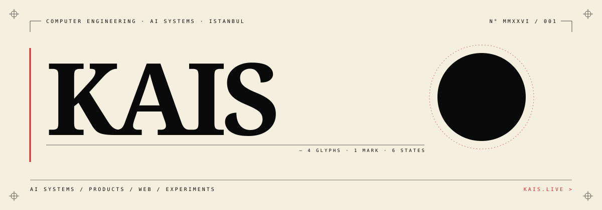

  

<table border="0" width="100%">
  <tr>
    <td valign="top" width="62%">

### what

I’m **Kais Aljammal**, a Computer Engineering student in Istanbul building AI products, developer tools, and practical web software.

I’m especially interested in real-time AI experiences, agent reliability, semantic caching, and products that turn complex systems into simple interfaces.

### now

Co-founder of**[Interviewlary](https://interviewlary.com)** while experimenting with AI infrastructure, autonomous-agent reliability, and learning tools.

### working set

`TypeScript` · `Python` · `Next.js` · `React` · `Supabase` · `PostgreSQL` · `MCP`

    </td>
    <td valign="top" width="38%" align="right">

<strong>SELECTED</strong> 
<code>01</code> &nbsp; <a href="https://interviewlary.com">Interviewlary</a> 
<code>02</code> &nbsp; <a href="https://github.com/kais-aljammal/tokenscache">TokensCache</a> 
<code>03</code> &nbsp; <a href="https://github.com/kais-aljammal/truthnet">TruthNet</a> 
<code>04</code> &nbsp; <a href="https://github.com/kais-aljammal/reliability-guard">Reliability Guard</a>

<strong>FIND</strong> 
<a href="https://kais.live">kais.live</a> 
<a href="https://kais.live/cv.html">CV / Resume</a> 
<a href="https://www.linkedin.com/in/kaisaljammal/">LinkedIn</a> 
<a href="https://www.instagram.com/kaiss.tech/">@kaiss.tech</a>

    </td>
  </tr>
</table>

---

### selected work

**01 / [Interviewlary](https://interviewlary.com)**  
AI interview practice built around role-specific preparation, voice/text interaction, and actionable feedback.

**02 / [TokensCache](https://github.com/kais-aljammal/tokenscache)**  
Semantic caching middleware for AI workflows, built to reduce repeated model work and unnecessary token usage.

**03 / [TruthNet](https://github.com/kais-aljammal/truthnet)**  
A multi-agent fact-checking experiment built around adversarial review and competing model perspectives.

**04 / [Reliability Guard](https://github.com/kais-aljammal/reliability-guard)**  
A reliability and evaluation layer for agentic systems, focused on catching incorrect actions before they propagate.

---

  COMPUTER ENGINEERING · AI SYSTEMS · PRODUCTS · ISTANBUL

